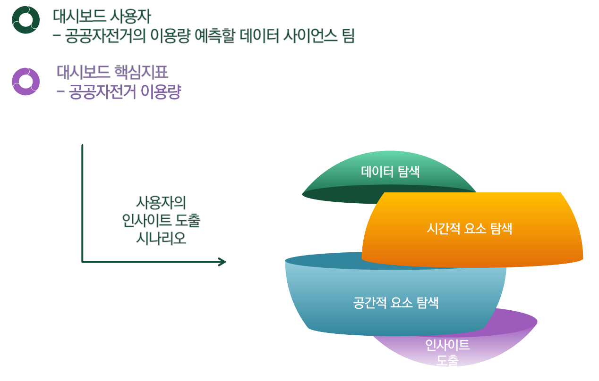
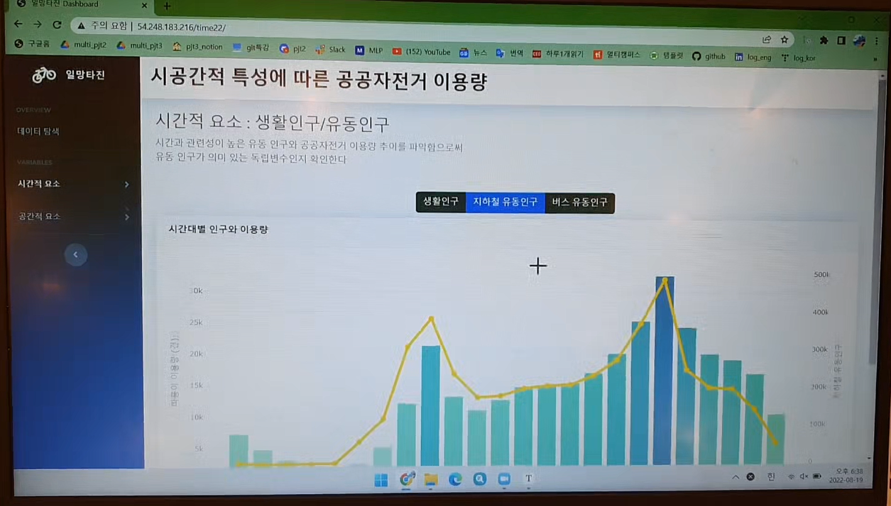
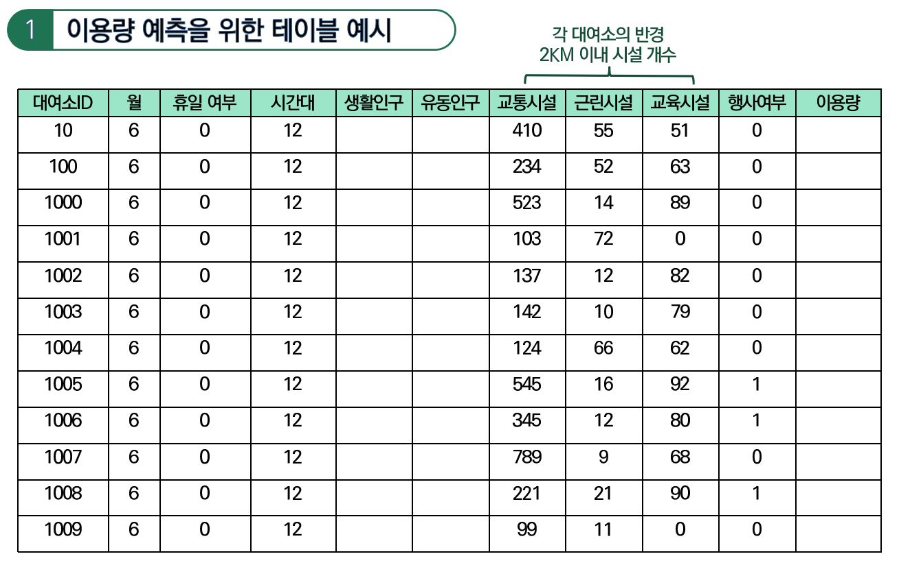
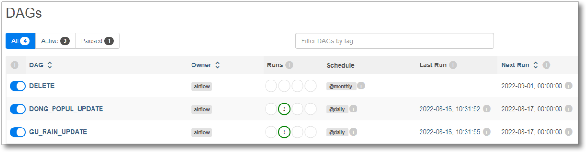

# 대여소별 시공간적 특성을 활용한 이용량 예측 및 자전거 재배치를 위한 데이터 파이프라인 구축

---

- [1. 프로젝트 개요](#1--------)
  * [1.1. 프로젝트 소개](#11--------)
  * [1.2. 프로젝트 목표](#12--------)
  * [1.3. 파이프라인 설계](#13---------)
- [2. 프로젝트 수행](#2--------)
  * [2.1. 데이터 수집 및 적재](#21------------)
  * [2.2. 데이터 처리 및 가공](#22------------)
  * [2.3. 파이프라인 운영 및 관리](#23--------------)
  * [2.4. 시각화 대시보드 구현](#24------------)
  * [2.5. 서버 배포](#25------)
- [3. 프로젝트 마무리](#3---------)
  * [3.1. 기대효과](#31-----)
  * [3.2. 개발 후기](#32------)
- [참고 문헌](#-----)

---

## 1. 프로젝트 개요

### 1.1. 프로젝트 소개

- 프로젝트 기간 : 2022.07.28 ~ 2022.08.17
- 프로젝트 팀 : 데이터 엔지니어 5명
  - 팀장 : 주한나
  - 팀원 : 문영호, 이주학, 송원혁, 신유하
- 프로젝트 배경
  - 공공자전거 따릉이 누적 이용은 1억 건을 돌파한 반면 해당 사업에 대한 손실은 2021 년 100억원
  - 이용량은 점차 증가하는 반면에 운영할 수록 적자가 발생하는 공공자전거 사업을 지속가능하도록 하기 위해 효율적인 운영이 시급
  - 한 [기사](https://www.hankookilbo.com/News/Read/A2021092317270001174?did=MN)에 따르면 창원 공공자전거인 누비자의 경우 전체 운영비의 3분의 1 이상을 자전거 재배치에 사용
  - 이처럼 제한된 예산에서 공공자전거 사업을 효율적으로 운영하기 위해서는 대여소별 이용량을 예측하여 재배치에 활용할 수 있도록 함이 필요
  - 따라서  각 대여소별 따릉이 이용량 예측 모델 개발을 위한 데이터 파이프라인 구축을 주제로 선정
  - 따릉이 이용량 예측을 위해 각 대여소 주변의 공간적 요소와 시간적 요소들을 독립변수 설정하고 대여소의 이용량을 종속변수로 선정

### 1.2. 프로젝트 목표

- 대여소별 시공간적 특성을 활용한 따릉이 이용량 예측 및 자전거 재배치를 위한 데이터 셋 구축
- 독립 변수
  - 공간적 요소 : 교통 시설, 근린 시설, 교육 시설
  - 시간적 요소 : 월, 휴일 여부, 시간대, 생활 인구, 유동 인구
  - 예외 요소 : 강우량
    - 따릉이 이용량 이상치에 영향을 줄 수 있는 요소로 추가 수집 결정
- 종속 변수
  - 각 대여소별 이용량

### 1.3. 파이프라인 설계

## 2. 프로젝트 수행

### 2.1. 데이터 수집 및 적재

- **데이터 수집 방식**

- **데이터 명세서**

| no   | 이름                                       | 출처                          | 수집 방식   | 크기(행) | 처리 형식 |
| ---- | ------------------------------------------ | ----------------------------- | ----------- | -------- | --------- |
| 1    | 서울시 따릉이 대여소 마스터 정보           | 서울 열린데이터 광장          | 파일        | 3104     | csv       |
| 2    | 서울시 공공자전거 대여이력 정보            | 서울 열린데이터 광장          | 파일        | 35449909 | csv       |
| 3    | 서울시 행정구역 코드 정보                  | 서울 열린데이터 광장          | 파일        | 424      | csv       |
| 4    | 행정동 단위 서울 생활인구(내국인)          | 서울 열린데이터 광장          | API         | 946368   | json      |
| 5    | 서울시 행정동별 버스 총 승차 승객수 정보   | 서울 열린데이터 광장          | API         | 89464    | json      |
| 6    | 서울시 행정동별 지하철 총 승차 승객수 정보 | 서울 열린데이터 광장          | API         | 90736    | json      |
| 7    | 서울시 역사마스터 정보                     | 서울 열린데이터 광장          | API         | 764      | json      |
| 8    | 서울시 정류장마스터 정보                   | 서울 열린데이터 광장          | API         | 70317    | json      |
| 9    | 서울시 자전거 도로                         | 네이버 지도                   | API         | 11       | json      |
| 10   | 전국초중등학교 위치표준데이터              | 공공데이터포털                | 파일        | 23948    | json      |
| 11   | 서울시 대학 및 전문대학 DB 정보(한국어)    | 서울 열린데이터 광장          | API         | 64       | csv       |
| 12   | 서울시 대학 위치데이터                     | 카카오 지도                   | API         | 64       | json      |
| 13   | 서울시 대규모점포 인허가 정보              | 서울 열린데이터 광장          | API         | 965      | json      |
| 14   | 서울시 주요 공원 현황                      | 서울 열린데이터 광장          | API         | 132      | json      |
| 15   | 서울시 문화공간 정보                       | 서울 열린데이터 광장          | API         | 803      | csv       |
| 16   | 서울시 문화행사 정보                       | 서울문화포털                  | 크롤링, API | 139      | json      |
| 17   | 서울시 강우량 정보                         | 서울 열린데이터 광장          | API, 파일   | 2431464  | csv       |
| 18   | 서울시 관광 명소                           | 서울시 공식 관광정보 웹사이트 | 크롤링      | 280      | csv       |
| 19   | 서울시 관광 명소 위치데이터                | 카카오 지도                   | API         | 280      | csv       |
| 20   | 서울시 관광 명소 별점                      | 구글맵                        | 크롤링      | 280      | csv       |

### 2.2. 데이터 처리 및 가공

- **DB**

- **MongoDB**
  - 위치 데이터 **GEO JSON** 형태 변환 및 총 10개의 collection 으로 MongoDB 에 저장
    - 교통 시설 : 자전거 대여소, 자전거 도로, 지하철 역, 버스 정류장
    - 근린 시설 : 공원, 대규모 점포, 문화 공간, 관광 명소, 이벤트 장소
    - 교육 시설 : 학교 (초등학교, 중학교, 고등학교, 대학교)
  - 이슈 사항
    - 원본 데이터의 JSON 형태 미지원
      - API 데이터 수집 및 JSON 형태로 재처리
    - 관광명소 및 행사장소의 위치 데이터 부재
      - 카카오 API 를 사용하여 각 장소에 대한 위치 데이터 추가 수집
    - 대규모 점포 위치 데이터가 중부원점 TM 좌표계에 따른 좌표로 다른 위치 데이터와 좌표계가 상이
      -  pyproj 라이브러리를 활용하여 위도 경도(EPSG:4326)로 변환
- **MySQL**
  - 이슈 사항
    - 테이블들을 서로 조인하기 위해 형식을 통일하는 부분에서 많은 이슈가 발생
    - 생활인구와 유동인구 데이터의 행정동 코드가 각각 7자리, 8자리로 상이
      - 두 데이터를 조인하기 위해 행정동 코드 데이터 추가 수집 후 DONG_CODE 테이블 생성
    - 자전거 대여소 staton_id(0001) 와 대여이력 정보의 station_id(ST-0001) 의 형식이 다름
      - 숫자 형식으로 통일
    - 자전거 대여소 정보에 행정동 정보 부재
      - 카카오 API 를 사용하여 각 대여소의 행정동 정보 추가 수집
    - 자전거 대여이력 및 유동인구의 방대한 데이터 양으로 처리 시간 지연 및 저장 공간 부족
      - AWS 서버 상 에서 대용량 데이터 가공 및 MySQL 저장

### 2.3. 파이프라인 운영 및 관리

- DAG1 : 강우량 데이터 업데이트
  - Raw Data 수집 및 로컬 저장 > Raw Data 하둡 저장 > Spark 로 처리 및 MySQL 의 GU_RAIN 테이블 업데이트

  

- DAG2 : 동별 인구 업데이트
  - Raw Data 수집 및 로컬 저장 > Raw Data 하둡 저장 > Spark 로 처리 및 MySQL 의 DONG_POPUL 테이블 업데이트

  

- DAG3 : 로컬 및 하둡 데이터 삭제
  - 로컬에서 Raw Data 삭제 > 하둡에서 Raw Data 삭제

  

### 2.4. 시각화 대시보드 구현

### 2.5. 서버 배포

- AWS 를 통한 대시보드 서버 배포

    

## 3. 프로젝트 마무리

### 3.1. 기대효과

- 시간에 따라 데이터가 생성되는 유동 인구와 강우량 데이터를 수집하여 MySQL 에 업데이트하는 데이터 플로우를 자동화하여 작업 시간 단축

  

### 3.2. 개발 후기

- 느낀 점
  - 데이터 처리 및 가공 과정에서의 많은 이슈 발생 가능성이 존재하기 때문에 추후 프로젝트 진행 시 해당 단계에 대한 일정 배분 시 충분한 시간을 할당해야 함을 체감하였다.
  - 위치 필터링을 이용한 위치 데이터 처리 과정에서 Geo JSON 가공 및 처리를 경험하고, Airflow 를 활용하여 데이터 수집부터 DB 저장까지 자동화할 수 있어서 의미 있었다.
  - 대량의 데이터를 가공 및 처리하면서 발생했던 이슈들을 해결하는 과정에서 많은 것을 배웠다.

## 참고 문헌

- 참고 논문
  - 공공자전거이용환경만족도영향요인분석(김소윤, 이경환, 고은정)
  - 서울시 공공자전거 이용에 영향을 미치는 물리적 환경 요인 분석(사경은, 이수기)
  - 서울공공자전거신규대여소를위한수요량예측분석(김예술, 박시온, 박군웅)
  - 공유자전거 시스템의 이용 예측을 위한 K-Means 기반의 군집 알고리즘 (김경옥, 이창환)
  - 서울시 공공자전거 이용에 영향을 미치는 물리적 환경 요인 분석(사경은, 이수기)
  - 네트워크 분석을 통한 공공자전거 따릉이의 이용특성에 대한 연구(강경희, 정진우)
  - 이용수요 기반의 서울시 공공자전거 재배치전략 도출(이은탁, 손봉수)

- 참고 기사
  - https://www.motorgraph.com/news/articleView.html?idxno=29857
  - https://www.mk.co.kr/news/society/view/2022/02/99087/
  - https://seoulsolution.kr/ko/content/9613
  - https://news.mt.co.kr/mtview.php?no=2022061514490583946&VNC_T
  - http://www.sobilife.com/news/articleView.html?idxno=31996
  - https://www.hankookilbo.com/News/Read/A2021092317270001174?did=MN
